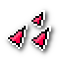

# NEON_SHOT
Gra stworzona jako drugi projekt z kursu "Programowanie obiektowe".

Link do wytycznych: [Strzelanka 2d](https://github.com/apohllo/obiektowe-lab/blob/master/proj2/strzelaninka2d.md)

## Sterowanie
Menu:
* W,A,S,D - Poruszanie
* ENTER/SPACE - Potwierdź
* ESCAPE - Wróć

Grasz 1:
* W,A,S,D - Poruszanie
* SPACE - Strzał

Gracz 2:
* Strzałki - Poruszanie
* . - Strzał

## Przedmioty
| Wygląd                                    | Nazwa             | Opis                                   |
|:------------------------------------------|-------------------|----------------------------------------|
|         | Bandaż            | Odnawia życie o 30 jednostek           |
|      | Extra prędkość    | Zwiększa prędkość poruszania się o 10% |
|       | Rapidfire         | Zwiększa prędkość strzelania się o 43% |
|     | Większe obrażenia | Zwiększa zadawane obrażenia o 50%      |

## Przeciwnicy
| Wygląd                               | Nazwa    | Opis                                   |
|:-------------------------------------|----------|----------------------------------------|
|      | Pawn     | Przesuwa się w czterek kierunkach      |
|    | Sentry   | Strzela w czterech kierunkach          |
|  | Bildstod | Porusza się w liniach prostych         |
